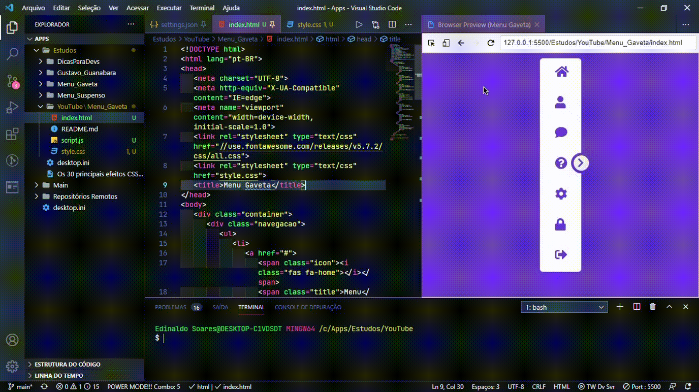

<h1 *align*="center">Menu Gaveta​​</h5>

<p align="center">

  <a href="https://github.com/ednaldosdl/Menu_Gaveta" target="_blank">

    

 </a>

#  Menu Gaveta

 Construindo um menu gaveta..

## Tarefas

 O controle das tarefas desse projeto será realizado abaixo.

 * Estrutura inicial

 * Estilização da estrutura

 * Ações dos elementos

 * Finalização do projeto.

## Ícones**

- 📦 Nova funcionalidade

- 🔄 Atualização

- 🐛 Correção de bug

- 🏁 Lançamento

  

- Praticando o conhecimento de HTML, CSS e JavaScript.
